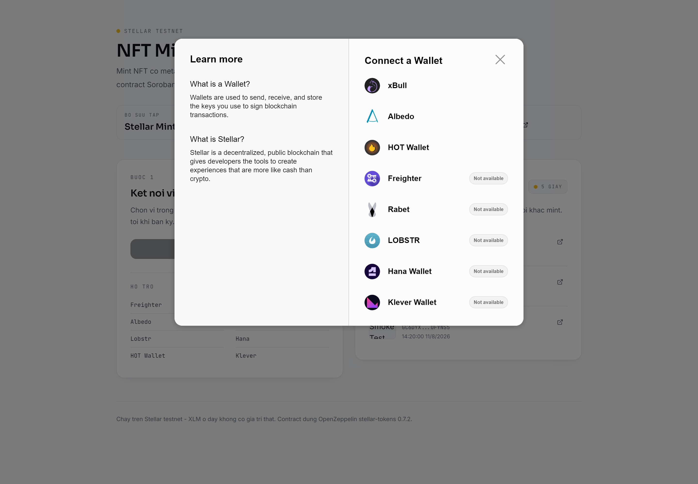
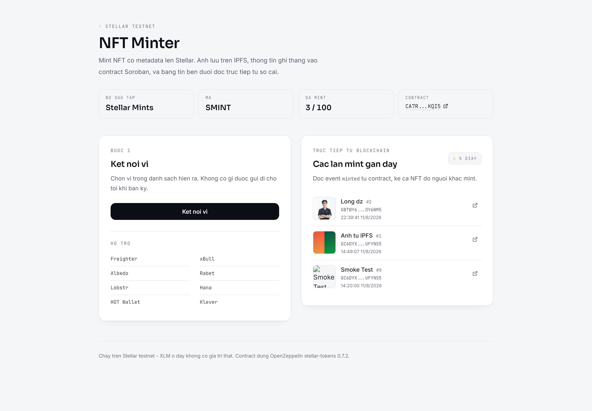

# NFT Minter — Stellar Testnet

Mint NFT có metadata lên Stellar. Ảnh lưu trên IPFS, thông tin ghi thẳng vào contract
Soroban, bảng tin đọc trực tiếp từ sổ cái.

## Thông tin nộp bài

| Mục | Giá trị |
|---|---|
| **Contract address** | [`CA7R5YUFEK5VGMY6V7TZKAJI3UESODFN77BFK37XVEHHBJUTFBANKQI5`](https://stellar.expert/explorer/testnet/contract/CA7R5YUFEK5VGMY6V7TZKAJI3UESODFN77BFK37XVEHHBJUTFBANKQI5) |
| **Mạng** | Stellar Testnet |
| **Live demo** | *(xem mục Live demo bên dưới)* |

### Transaction hash — kiểm chứng được trên Stellar Explorer

| Việc | Tx hash | Kết quả |
|---|---|---|
| Deploy contract | [`4421406195b06b50…`](https://stellar.expert/explorer/testnet/tx/4421406195b06b50a431b21f57a2001e1683bb7e6a6b2da61aa8c8569787e56e) | Upload Wasm |
| **Mint NFT #0** | [`36544bda58bea9d4…`](https://stellar.expert/explorer/testnet/tx/36544bda58bea9d4ef800c3fa0895164c38823b2f0fdabaa8f6188c990816257) | Success — phát 2 event |
| **Mint NFT #1** | [`f66202eb905ac48b…`](https://stellar.expert/explorer/testnet/tx/f66202eb905ac48b46a9b9ea605d1a6adce5a0747d7231606fe0e75de3ec35a2) | Success — CID thật từ IPFS |

Event của lần mint `#1`, đọc trực tiếp từ sổ cái:

```
Event: Mint   (mint)    to: GC6DYXYX…, token_id: 1
Event: Minted (minted)  to: GC6DYXYX…, token_id: 1,
                        name: "Anh tu IPFS",
                        cid: "QmYZ9ZYJkk73ESJxxyKBAFeTX319Yjv6tFRVifX5dScxZV",
                        minted_at: 1786434547
```

Ảnh của NFT #1 trên IPFS:
[`QmYZ9ZYJkk73ESJxxyKBAFeTX319Yjv6tFRVifX5dScxZV`](https://gateway.pinata.cloud/ipfs/QmYZ9ZYJkk73ESJxxyKBAFeTX319Yjv6tFRVifX5dScxZV)

---

## Đối chiếu yêu cầu Level 2

| Yêu cầu | Ở đâu | Bằng chứng |
|---|---|---|
| 3 error types handled | `contracts/nft-minter/src/lib.rs`, `web/lib/errors.ts` | **4** lỗi contract + phân loại **3 tầng** ở frontend |
| Contract deployed on testnet | `CA7R5YU…BANKQI5` | Đã mint thật, xem link explorer bên trên |
| Contract called from frontend | `web/lib/contract.ts` | `mintNft()` — build → simulate → ký → submit → chờ ledger |
| Transaction status visible | `web/components/TxStatus.tsx` | Máy trạng thái 6 bước, tx hash + link explorer |
| 2+ meaningful commits | `git log` | 5 commit, mỗi commit ghi rõ *tại sao* |
| Multi-wallet | `web/lib/wallet.ts` | 8 ví: Freighter, xBull, Albedo, Rabet, Lobstr, Hana, HOT, Klever |
| Real-time event integration | `web/lib/events.ts` | Poll `getEvents` mỗi 5s, hiện cả NFT người khác mint |

---

## Ảnh chụp

### Các ví được hỗ trợ

Modal chọn ví của Stellar Wallets Kit — 8 ví, mỗi ví hiện rõ đã cài hay chưa:



### Toàn bộ ứng dụng

Form mint bên trái, bảng tin đọc trực tiếp từ sổ cái bên phải:



---

## Live demo

> **URL:** _(điền vào sau khi deploy)_

Deploy lên Vercel:

1. [vercel.com/new](https://vercel.com/new) → Import repo `longdevbf/stellar-nft-minter`
2. **Root Directory** → chọn `web` (bắt buộc — Next.js nằm trong thư mục con, không phải gốc repo)
3. Thêm 4 biến môi trường:

   | Tên | Giá trị | Ghi chú |
   |---|---|---|
   | `PINATA_JWT` | *(JWT của bạn)* | **Không** có tiền tố `NEXT_PUBLIC_` |
   | `NEXT_PUBLIC_CONTRACT_ID` | `CA7R5YUFEK5VGMY6V7TZKAJI3UESODFN77BFK37XVEHHBJUTFBANKQI5` | |
   | `NEXT_PUBLIC_RPC_URL` | `https://soroban-testnet.stellar.org` | |
   | `NEXT_PUBLIC_NETWORK_PASSPHRASE` | `Test SDF Network ; September 2015` | Có dấu cách quanh `;` |

4. **Framework Preset** phải là **Next.js**, không được để **Other**
5. Deploy

### Nếu gặp lỗi `No Output Directory named "public" found`

Vercel quét **gốc repo** để đoán framework lúc import. Gốc repo này là `Cargo.toml`
(project Rust), không có `package.json`, nên Vercel kết luận **Other**. Đặt Root
Directory thành `web` sau đó **không** làm preset tự đổi lại. Preset `Other` vẫn chạy
`npm run build` nên build thành công, nhưng khâu thu output lại đi tìm thư mục `public`
kiểu web tĩnh — trong khi Next.js xuất ra `.next`.

⚠️ **Đừng làm theo gợi ý trong thông báo lỗi.** Đặt Output Directory thành `.next` sẽ
tạo ra một trang tĩnh hỏng và mất luôn route `/api/ipfs` — chính chỗ giữ `PINATA_JWT`
ở phía server.

File [`web/vercel.json`](web/vercel.json) đã khai báo sẵn `framework: nextjs` để cấu hình
nằm trong repo thay vì phụ thuộc vào thiết lập trên giao diện. Nếu vẫn lỗi, vào
**Project Settings → General → Framework Preset** đổi thành **Next.js** rồi redeploy.

`installCommand` trong file đó cũng đặt sẵn `npm install --ignore-scripts` — xem
[Ghi chú Windows](#ghi-chú-windows) để biết vì sao (nguyên nhân là `postinstall` của một
dependency, không riêng gì Windows).

Chạy ở máy thì xem mục [Chạy thử](#chạy-thử) bên dưới.

---

## Kiến trúc

```
Trình duyệt (Next.js)
   │ ① upload ảnh
   ▼
/api/ipfs ──────► Pinata            JWT chỉ ở server, không vào bundle
   │ ◄── CID
   │ ② build + simulate
   ▼
Stellar Wallets Kit ──► ví ký
   │ ③ submit
   ▼
Soroban RPC ──► NFT Contract (OpenZeppelin stellar-tokens 0.7.2)
   │ ④ poll getEvents mỗi 5s
   ▼
Bảng tin trực tiếp
```

---

## Contract

Chuẩn NFT (`transfer`, `approve`, `burn`, `owner_of`…) lấy nguyên từ OpenZeppelin.
Phần viết thêm:

### Metadata riêng từng token

OZ `Base` chỉ có base-URI ở cấp bộ sưu tập (`token_uri = base_uri + token_id`), nên
không lưu được CID riêng cho mỗi ảnh. Contract lưu thêm:

```rust
pub struct TokenMeta {
    pub name: String,       pub description: String,
    pub cid: String,        // CID ảnh trên IPFS
    pub minter: Address,    pub minted_at: u64,
}
```

### 4 loại lỗi

Đánh số **1–4** có chủ đích: OZ đã chiếm dải **200–214** cho `NonFungibleTokenError`,
dùng trùng sẽ khiến frontend đọc sai loại lỗi.

| Mã | Tên | Khi nào |
|---|---|---|
| 1 | `InvalidMetadata` | Tên rỗng/quá 64 ký tự, mô tả quá 280, CID dưới 32 ký tự |
| 2 | `SupplyExhausted` | Đã mint đủ `max_supply` |
| 3 | `DuplicateCid` | Ảnh này đã được mint rồi |
| 4 | `TokenNotFound` | Hỏi metadata của token chưa tồn tại |

### Event

```rust
#[contractevent]              // topic = "minted"
pub struct Minted { #[topic] to: Address, token_id: u32, name: String, cid: String, minted_at: u64 }
```

⚠️ Topic là **`minted`**, không phải `mint`. OZ đã dùng đúng `("mint", to)` cho event
chuẩn của nó — nếu trùng, frontend sẽ nhận nhầm event thiếu metadata. Kiểm chứng:
2 lần mint sinh 4 event trên chain, bộ lọc `minted` trả về đúng 2.

---

## Ba tầng lỗi ở frontend

Ba tầng khác nhau về **bản chất**, không phải ba nhánh `if` cho đủ số lượng:

| Tầng | Nguồn | Tự retry? | Vì sao |
|---|---|---|---|
| `contract` | Contract từ chối theo luật nghiệp vụ | ❌ | Thử lại sẽ thất bại y hệt, chỉ đốt phí. Phải sửa input. |
| `wallet` | User bấm Huỷ, ví khoá, ví sai mạng | ❌ | Chưa có gì lên mạng. Retry = spam popup vào mặt user. |
| `network` | RPC tạm thời không nhất quán | ✅ | Không ai sai. Thử lại sau vài giây là được. |

---

## Chạy thử

```powershell
# 1. Contract
cargo test                 # 10 test
.\deploy.ps1               # test → build → deploy → xác nhận

# 2. Frontend
cd web
copy .env.example .env.local    # rồi điền PINATA_JWT và NEXT_PUBLIC_CONTRACT_ID
npm install --ignore-scripts    # xem mục Ghi chú Windows bên dưới
npm run dev
```

Mở http://localhost:3000, cần một ví Stellar (khuyến nghị
[Freighter](https://freighter.app)) đã **chuyển sang Testnet** và có XLM từ
[Friendbot](https://friendbot.stellar.org).

Kiểm tra tầng đọc event mà không cần trình duyệt:

```powershell
cd web && node scripts/check-events.mjs
```

---

## Những cái bẫy đã gặp và cách xử lý

### RPC testnet công cộng không nhất quán

Endpoint `soroban-testnet.stellar.org` đứng sau load balancer gồm nhiều node ingest
lệch nhau. Đo bằng cách gọi `getLatestLedger` liên tục: số ledger **nhảy lùi**, biên độ
tới **9 ledger (~45 giây)**.

Cùng một gốc rễ nhưng hiện ra ba thông điệp khác nhau tuỳ giai đoạn hỏng:

| Thông điệp | Giai đoạn hỏng |
|---|---|
| `Contract not found` | Chưa tải được contract spec để parse tham số |
| `Storage, MissingValue` | Tải được spec nhưng host chưa nạp được instance |
| `TxBadSeq` | Đọc phải sequence cũ của tài khoản |

Cả `deploy.ps1` lẫn `web/lib/contract.ts` đều retry **đúng ba loại này** và báo ngay
với bất kỳ lỗi nào khác — để không nuốt lỗi thật.

### Docs Stellar sai hai chỗ

- Hướng dẫn dùng `#[default_impl]`, nhưng OZ v0.7.2 dùng `#[contractimpl(contracttrait)]`.
- Ghi *"IDs starting from 1"*, thực tế `Base::sequential_mint` đánh số **từ 0**.

### Xung đột phiên bản soroban-sdk

`stellar-tokens 0.7.2` phụ thuộc `soroban-sdk 26.1.1`. Để `soroban-sdk = "27"` thì cây
phụ thuộc có hai bản SDK cùng lúc và `Env` thành hai kiểu khác nhau → không compile.
Nhánh `main` của OZ đã chuyển sang SDK 27 nhưng chưa phát hành lên crates.io.

### Ghi chú Windows

- **`npm install --ignore-scripts`**: `postinstall` của `@trezor/blockchain-link` chạy
  `yarn setup || true`, mà `cmd.exe` không có lệnh `true` → npm báo lỗi.
- **Không dùng `allowAllModules()`**: hàm đó kéo Trezor → `@solana/web3.js` và các
  wallet-adapter Solana, mang theo hàng chục cảnh báo bảo mật và hàng MB hoàn toàn vô
  dụng với một dapp Stellar. Khai báo 8 module ví tường minh thay thế.
- **PowerShell 5.1 nuốt chuỗi rỗng** khi truyền cho native exe — dùng `--flag=""`.
- **Không dùng `2>&1` với native exe** trong PS 5.1: mỗi dòng stderr thành `ErrorRecord`,
  gặp `ErrorActionPreference = "Stop"` là throw dù lệnh trả exit code 0.

---

## Đã kiểm chứng

| Hạng mục | Kết quả |
|---|---|
| `cargo test` | 10/10 pass, phủ cả 4 loại lỗi và hình dạng event |
| `tsc --noEmit` | Sạch |
| `next build` | Thành công, 312 kB First Load JS |
| Upload IPFS | CID trả về, tải lại được từ gateway: HTTP 200, đúng byte |
| Nhánh lỗi API | 415 / 400 / 400 đúng như thiết kế |
| Mint on-chain | Token #0, #1 — cả hai event phát ra và phân biệt được |
| `DuplicateCid` | Trả về đúng `Error(Contract, #3)` trên mạng thật |
| Đọc event | Lọc đúng 2 event `minted` trong 4 event |
| Rò rỉ secret | `PINATA_JWT` **không** có trong `.next/static` và không có trong HTML |
